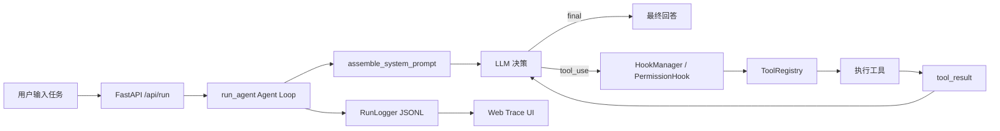

# Mini Claude Code / LoopForge

本项目基于 `learn-claude-code` 的学习与理解，复现一个 **mini 版 Claude Code Agent Runtime**。

它不是普通聊天机器人，也不是只包一层大模型 API，而是重点实现 Claude Code 背后的核心工程机制：**Agent Loop、工具调用、权限校验、Hooks、Todo、Task、MCP、后台任务、上下文压缩和执行轨迹可视化**。

## 适合人群

- 想理解 Claude Code / Coding Agent 底层原理的人
- 想学习大模型工具调用、Agent Loop、Prompt 组装的人
- 想把 AI Agent 项目写进简历，但不想只做聊天 Demo 的同学
- 想研究 Agent 工程化能力：权限、安全、可观察性、任务状态、上下文管理的人

## 项目解决了什么

很多 LLM 应用只是一次请求一次回答，模型无法真正持续执行复杂任务。

本项目实现了一个本地 Agent Harness，让模型可以：

- 多轮思考和行动
- 根据任务主动调用工具
- 工具执行前经过权限校验
- 工具结果回灌给模型继续推理
- 维护 todo 和 durable task 状态
- 记录完整运行轨迹
- 在前端把每一步执行过程可视化

## 成果展示

### Web 工作台

前端采用类 ChatGPT 的交互布局：中间是对话区，左侧是 Agent 状态和验收报告，右侧是运行轨迹。

```text
┌────────────────────┬──────────────────────────────┬──────────────────────┐
│ Agent 状态          │ Chat / Task 输入              │ Runtime Trace         │
│ - 工具调用统计      │ - 用户输入自然语言任务         │ - Story 视图          │
│ - 权限放行/拒绝     │ - Agent 最终回答               │ - Runtime 事件        │
│ - Todo 状态         │ - 综合验收入口                 │ - Raw JSON 事件       │
│ - 8 项验收报告      │                              │                      │
└────────────────────┴──────────────────────────────┴──────────────────────┘
```

### 综合验收模式

点击 **运行综合验收** 后，系统会自动执行一个复杂任务，并根据真实 trace 生成 8 项验收报告：

| 验收项 | 说明 |
|---|---|
| Agent Loop | 模型完成多轮决策并成功结束 |
| Todo Planning | 使用 `todo_write` 维护计划 |
| File Context | 读取工作区文件 |
| Workspace Search | 搜索 workspace 内容 |
| Permission Gate | 工具执行前经过权限校验 |
| MCP Routing | 调用 MCP 风格工具 |
| Durable Task | 创建并更新持久任务 |
| Background Task | 启动后台任务 |

真实验收结果示例：

```text
run_id: run-20260616-115859-814183
events: 80
status: success
acceptance: 8 / 8
tools:
  todo_write
  read_file
  search
  mcp__runtime__inspect_context
  task_create
  task_update
  background_task_start
```

## 架构图



## Agent Loop 流程

```mermaid
sequenceDiagram
    participant User as User
    participant Loop as Agent Loop
    participant Model as LLM
    participant Hook as Permission Hook
    participant Tool as Tool Registry
    participant Log as Run Logger

    User->>Loop: 输入自然语言任务
    Loop->>Model: 发送 system prompt + messages
    Model-->>Loop: 返回 assistant_message 或 tool_use
    Loop->>Log: 记录 assistant_message

    alt 模型请求工具
        Loop->>Hook: PreToolUse 权限校验
        Hook-->>Loop: allow / deny
        Loop->>Tool: 调用 read_file/search/task/MCP 等工具
        Tool-->>Loop: tool_result
        Loop->>Log: 记录 permission_check 和 tool_result
        Loop->>Model: 回灌工具结果
    else 模型完成任务
        Loop->>Log: 记录 final 和 run_finished
        Loop-->>User: 返回最终回答
    end
```

## 核心功能

- **真实 Agent Loop**：`run_agent()` 支持多轮模型决策、工具调用和 final 结束
- **工具注册系统**：`ToolRegistry` 统一注册和调度工具，避免散落 if/else
- **工具调用**：支持 `read_file`、`write_file`、`search`、`todo_write` 等
- **权限校验**：`PermissionHook` 在工具执行前检查访问权限
- **Hooks 管线**：支持 `BeforeModelCall`、`PreToolUse` 等扩展点
- **Prompt 组装**：`assemble_system_prompt()` 统一注入工具、规则、任务策略和运行约束
- **Todo 状态**：模型可用 `todo_write` 外化计划
- **Durable Task**：`TaskStore` 使用本地 JSON 持久化任务
- **后台任务**：支持 background task 和通知机制
- **MCP Mock**：实现 `mcp__runtime__inspect_context` 等 MCP 风格工具
- **上下文压缩**：长任务中自动 compact context，减少上下文膨胀
- **可观察性**：所有关键节点写入 JSONL，并在前端展示

## 目录结构

```text
mini-claude-code/
  backend/
    main.py
    agent/
      loop.py                    # Agent 主循环
      model/
        client.py                # OpenAI-compatible 模型调用
        prompt.py                # System Prompt 组装
      tools/
        registry.py              # 工具注册与调度
        mcp.py                   # MCP 风格工具
        results.py               # 工具结果管理
      policy/
        hooks.py                 # Hook 管线
        permissions.py           # 权限策略
      state/
        todos.py                 # Todo 状态
        tasks.py                 # Durable Task
        context.py               # 上下文压缩
      execution/
        background.py            # 后台任务
        subagents.py             # 子 Agent
      observability/
        run_logger.py            # JSONL 轨迹日志
    workspace/
      hello.txt
      agent_runtime_case.md

  frontend/
    index.html
    app.js                       # 对话、轨迹、验收报告
    style.css

  requirements.txt
  .env.example
  README.md
```

## 快速启动

安装依赖：

```powershell
pip install -r requirements.txt
```

复制环境变量文件：

```powershell
copy .env.example .env
```

填写 `.env`：

```text
DEEPSEEK_API_KEY=your_deepseek_api_key_here
DEEPSEEK_MODEL=deepseek-v4-flash
DEEPSEEK_BASE_URL=https://api.deepseek.com
```

启动后端：

```powershell
cd backend
python -m uvicorn main:app --host 127.0.0.1 --port 8000
```

打开页面：

```text
http://127.0.0.1:8000/
```

## API

提交任务：

```http
POST /api/run
Content-Type: application/json

{
  "task": "请读取 hello.txt，并总结它验证了什么"
}
```

读取运行轨迹：

```http
GET /api/runs/{run_id}
```

健康检查：

```http
GET /health
```

## 运行事件

每次运行都会生成结构化事件，例如：

```text
run_started
prompt_built
user_message
model_call_started
assistant_message
tool_use
permission_check
tool_result
todo_updated
task_created
task_updated
background_task_started
mcp_tool_called
context_compacted
final
run_finished
```

这些事件是项目的核心价值：不仅知道 Agent 最后回答了什么，还能看到它中间如何决策、调用了哪些工具、权限是否通过、上下文是否压缩、任务状态如何变化。

## 安全说明

- 不要提交 `.env`
- `.env.example` 只保留占位符
- `.gitignore` 已忽略运行日志、任务状态、服务日志、pid、缓存文件
- 文件工具限制在 `backend/workspace`
- 工具执行前会记录权限校验事件
- 本项目是学习型 Runtime 原型，不是生产级安全沙箱

## 简历描述

可以这样写：

> 基于 learn-claude-code 复现 Mini Claude Code Agent Runtime，实现多轮 tool-use agent loop、工具注册系统、权限 Hooks、Todo/Task 状态管理、MCP 风格工具、后台任务、上下文压缩、JSONL 可观察性日志，并开发 Web UI 展示 Agent 执行轨迹和 8 项综合验收报告。

